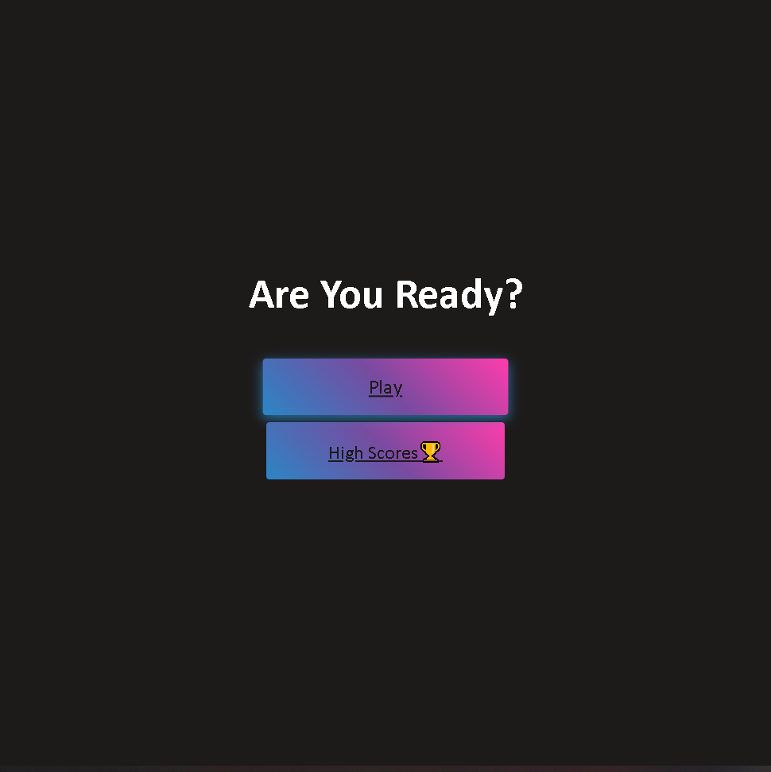

# Quiz-Challenge

Week 4 Quiz Challenge
The challenge this week was to create a webpage where a user could take a quiz and upon completion save their score to a "HighScores" page. My webpage features a multiple-choice four question quiz on JavaScript with every correct answer increasing the user's score by 100 points.

To play, simply select "Play" on the home page to start the quiz

Proceed to answer the questions until the end of the quiz

Link to deployed application: https://brandongiordano.github.io/Quiz-Challenge/

Enter your name to save your score

.png>)
.png>)

KNOWN BUGS:
  App works as intended when tested from VS Code both in default browser and live server but crashes after completion of the quiz on github pages
  
  Error with highscores. The first saved high score is not displayed, only the subsequent highscores
  
